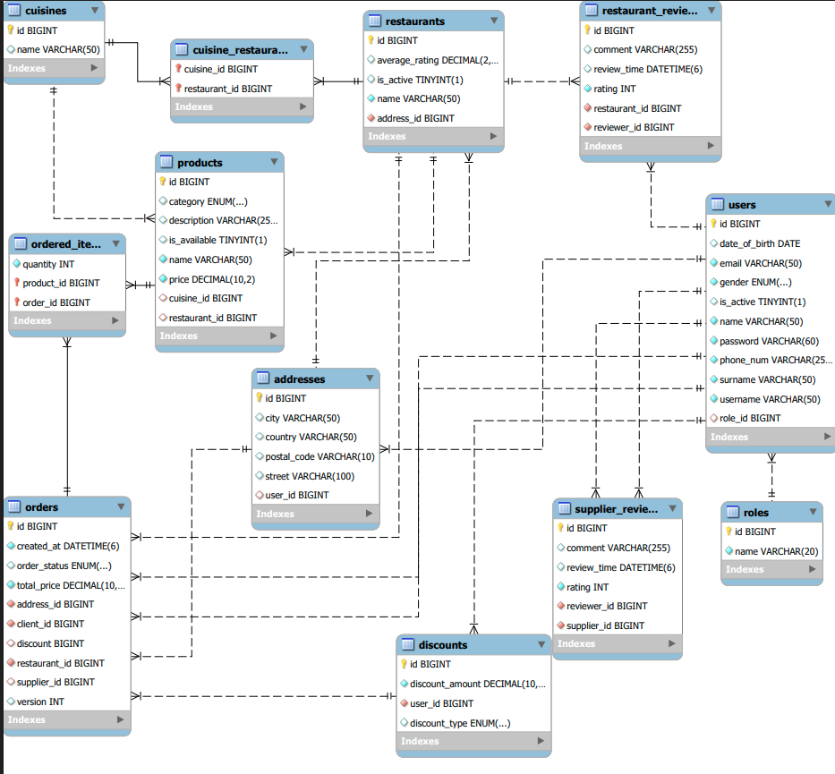

# FoodDeliveryApp
Samo Levski 
# Техническа документация
**Проект:** Food Delivery Application – ZaExpress Delivery   

**Автори:** Антоанета Мандажиева, Михаел Гущеров, Стоян Зайков, Калоян Йоргов, Хюсеин Адем  
**Дата на предаване:** 02.05.2025

---

## 1. Цел на проекта
Целта на проекта е разработката на уеб базирано приложение за онлайн поръчка и доставка на храна. Системата предоставя отделни интерфейси за различните типове потребители – клиенти, служители, доставчици и администратори. Платформата поддържа създаване, управление и проследяване на поръчки, добавяне на продукти, писане на отзиви, както и прилагане на бонуси и отстъпки.

---

## 2. Използвани технологии

### Backend (Java 23)
- **Фреймуърк:** Spring Boot (`spring-boot-starter-web`, `spring-boot-starter-data-jpa`)
- **Достъп до база данни:** JDBC MySQL connector
- **База данни:** MySQL
- **Билд инструмент:** Maven
- **Тестване:** JUnit 5, Mockito
- **Конфигурация и мапинг:** ModelMapper

### Frontend (React)
- **Език:** JavaScript (съвместим с TypeScript типове)
- **Библиотека за интерфейс:** React 19
- **Роутинг:** React Router DOM
- **Формуляри:** React Hook Form
- **HTTP заявки:** Axios
- **UI и стилове:** Tailwind CSS 4
- **Анимации:** GSAP
- **Уведомления:** React Toastify
- **Валидиране и утилити функции:** Lodash, debounce, date-fns
- **Иконки:** Lucide React
- **Сборка и разработка:** Vite
- **Linting:** ESLint

---

## 3. Архитектура

Проектът следва слоеста архитектура, базирана на принципите на разделяне на отговорностите и клиент-сървър модел.

- `controller` – обработва HTTP заявки от клиентската част.
- `service` – реализира бизнес логика чрез имплементации в `impl`.
- `repository` – достъп до базата чрез Spring Data JPA интерфейси.
- `entity` – обектно-релационни модели, свързани с таблиците.
- `dto` – пренася структурирани данни между слоевете.
- `mapper` – преобразува entity <-> dto чрез ModelMapper.
- `config`, `exception`, `util` – конфигурации, грешки и помощни компоненти.
 

---

## 4. Основни класове и пакети

| Пакет       | Подпакети / Класове                                      | Роля и описание                                               |
|-------------|-----------------------------------------------------------|----------------------------------------------------------------|
| controller  | auth, order, user, restaurant, review, cuisine           | REST контролери, обработващи заявки                            |
| service     | auth, order, user, restaurant и др. + `impl`             | Бизнес логика и връзка с репозитори                            |
| repository  | OrderRepository, UserRepository и др.                    | Достъп до базата чрез Spring Data JPA                          |
| entity      | Order, User, Product, Restaurant и др.                   | Представя таблиците като Java обекти                           |
| dto         | OrderDto, UserDto, AddressDto и др.                      | Пренасяне на данни между слоевете                              |
| mapper      | OrderMapper, UserMapper и др.                            | Преобразуване entity <-> dto                                   |
| config      | ModelMapperConfig, GlobalExceptionHandler и др.         | Конфигурации                                                   |
| exception   | auth, order, base и др.                                  | Персонализирани изключения                                     |
| util        | Messages, SystemErrors                                   | Помощни класове и константи                                    |

---

## 5. База данни

| Таблица        | Описание                                                                 |
|----------------|--------------------------------------------------------------------------|
| `users`        | Всички типове потребители – клиенти, ресторанти, доставчици, служители  |
| `roles`        | Роли като CLIENT, ADMIN, SUPPLIER и др.                                  |
| `orders`       | Поръчки със статус и връзки към клиент, ресторант и доставчик           |
| `ordered_items`| M:N таблица между поръчки и продукти                                     |
| `products`     | Меню на ресторантите                                                    |
| `restaurants`  | Информация за ресторанти, адрес, кухня и др.                            |
| `addresses`    | Адреси на потребители и ресторанти                                       |
| `discounts`    | Отстъпки към поръчки                                                     |
| `reviews`      | Ревюта за ресторанти и доставчици                                        |
| `cuisines`     | Видове кухни (италианска, китайска и др.)                               |

---

## 6. Бизнес логика
*Хю*

---

## 7. Работен процес – пример

1. Потребител създава акаунт и влиза в системата.
2. Клиент разглежда ресторанти (филтрира по кухня, локация).
3. Избира ресторант → преглежда меню → избира продукти.
4. Създава поръчка. Системата:
    - Проверява възраст при алкохол.
    - Проверява валиден адрес.
    - Изчислява стойност.
    - Прилага бонус, ако има.
5. Статус: `PENDING`
6. Доставчик избира поръчка.
7. Служител потвърждава → статус: `ACCEPTED`
8. Ресторант подготвя → статус: `PREPARING`
9. Доставчик взима → статус: `IN_DELIVERY`
10. При доставка → статус: `DELIVERED`
11. Клиент оставя ревю (по избор).

---

## 8. Тестване

### Технологии:
- **JUnit** – unit и интеграционни тестове
- **Mockito** – мокване на зависимости
- **Spring Test + MockMvc** – тестове за контролери

### Общо тестове: ~187

| Клас                            | Тип       | Брой |
|---------------------------------|-----------|------|
| OrderServiceImplTest            | Service   | 39   |
| RestaurantServiceImplTest       | Service   | 27   |
| UserServiceImplTest             | Service   | 16   |
| AuthServiceImplTest             | Service   | 7    |
| DiscountServiceImplTest         | Service   | 6    |
| CuisineServiceImplTest          | Service   | 2    |
| RestaurantReviewServiceImplTest | Service   | 4    |
| SupplierReviewServiceImplTest   | Service   | 6    |
| OrderControllerTest             | Controller| 11   |
| RestaurantControllerTest        | Controller| 22   |
| UserControllerTest              | Controller| 17   |
| AuthControllerTest              | Controller| 4    |
| CuisineControllerTest           | Controller| 2    |
| SupplierReviewControllerTest    | Controller| 2    |
| OrderMapperTest                 | Mapper    | 8    |
| UserMapperTest                  | Mapper    | 6    |
| ReviewMapperTest                | Mapper    | 6    |
| OrderedItemMapperTest           | Mapper    | 2    |

### Тествано поведение:
- Регистрация и вход
- Ограничения по роля
- Валидност на параметри
- Преходи между статуси
- Изчисления за отстъпки, бонуси
- Edge cases – невалидни потребители, празна количка и др.

---

## 9. Стартиране на проекта

1. Клонирайте проекта или използвайте ZIP архив.
2. Импортирайте го като Maven проект (например в IntelliJ IDEA).
3. Конфигурирайте `application.properties` в `src/main/resources`:

